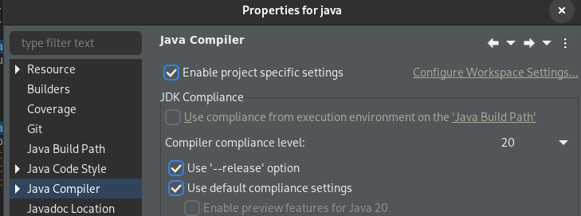
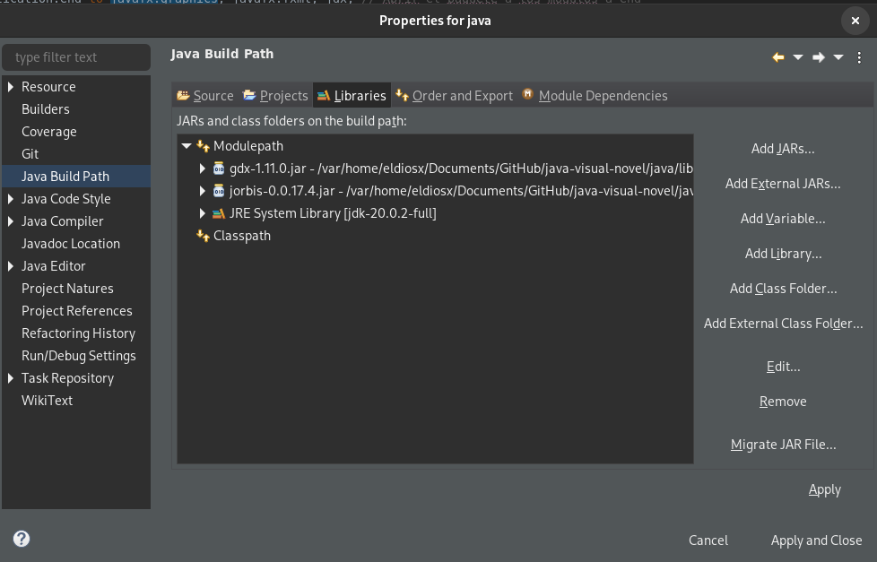

<h1 align="center">Tu “videojuego” favorito de serie B</h1>

- <h2>Members and credits: </h2>

Daniel Delgado Jiménez - Team Leader 
Adrian Márquez Ruiz - Backend 
Aida Fernández Hormigo - Frontend 

**GNU License**
Copyright (c) 2023 [LICENSE](https://github.com/eldiosx/novelaGraficaJava/blob/main/LICENSE).

- <h2>Information: </h2>
Your favorite B-series “video game” is a demo for the development of a <b>Graphic Novel made with Java</b> video game framed in the setting of American horror slashers, especially from the 90s and the 2000s, which aims to follow in the wake of films such as the "Blair Witches Project" or the "Silent Hill" saga.
<h3>Introduction to the project: </h3>
This is a project that aims to offer the player a narrative experience like the one offered by other video games such as "Detroit Become Human", but with a touch of humor. Full of clichés, it aims to offer the player a first-person experience of a B-series horror movie. It has a high replayability due to the large amount of decision-making and possible tragic endings.
<h3>Introduction to the environment: </h3>
To make this project a reality, we have been inspired by the genre of video games called graphic adventures, in which the player is presented with a series of characters who have to make decisions, and these choices will determine the course of the adventure. Regarding the pure setting, we want to give a gloomy atmosphere, since the plot will take place in a summer camp located in a forest.
<h3>Context of the game: </h3>
This project presents the conflict of a group of teenagers who have recently arrived at a summer camp in Connecticut.

- <h2>Implementation: </h2>
<i>"Complexity is destructive. It sucks the blood of developers, makes products difficult to plan, build, and test, introduces security issues, and causes frustration for end users and administrators" Ray Ozzie</i>

The implementation of the project has been carried out in Java and Java FX with integration with MySQL and .Ogg audio support, seeking the greatest simplicity within the complexity of the project itself and the complexity of working with a team of such different people. .
<h3>Java project: </h3>
We started the project with the tools taught in class, and given their limitations, we decided to carry out the project integrating Java FX. Also at first we designed a class diagram, which in the end has been discarded due to the specific needs of the project, that each Stage needs to be its own class, plus the Main of cd package, which integrates these different classes.
<h3>Database: </h3>
In the initial project, a database is proposed that stores the saved games, the images generated for each scene and, finally, the sound tables, a table for the dialogues in which the recorded dialogues and the generic tracks of Audio.
<h3>Sound: </h3>

Support for .ogg audio at the best quality and fluidity without making the files too heavy.

<b>Hardware:</b>

RØDE NT1-A

Focusrite Scarlett 2i2 3rd Gen

HyperX HX-HSCF-BK Cloud Flight

Steam Deck

<b>Software:</b>

Linux 6.1

Audacity

- <h2>How to edit: </h2>

First we need a JavaFX, the easiest way is: https://bell-sw.com/pages/downloads/ Download the FUll JDK version.

<h3>For Eclipse (flatpak compatible): </h3>

The WorkSpace is "java-visual-novel" and the folder to import proyect is the folder "java"

Choose Java 20 on Eclipse

Import all .jar on "lib" folder, you need add your JavaFX libraries or a Full Java JDK in the jre installed and module-path:

<h3>For VsCode/ VsCodium (flatpak compatible): </h3>

You will need Extension Pack for Java and condigure settings.json similar like this:

The folder to open is "java" and it will take all routes and libs automatic.

<h3>For IntelliJ (flatpak compatible): </h3>

You can use the easy method, importing from github u will need install git on terminal and setup JavaFx JDK:

